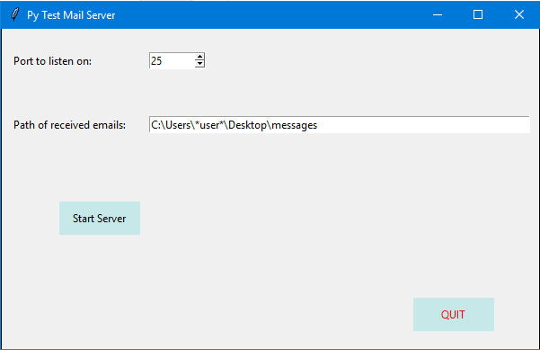

# PyTestMailServer

A local mail testing server, built specifically to support multithreading.



## Usage
```
python main.py
```
Enter port and click 'Start Server'.

Received emails will appear at the displayed path.

## Testing
Set default port in config.py.

```
python send_email_test.py
```

Alternatively, use any other [email sender](https://docs.spring.io/spring/docs/3.2.x/spring-framework-reference/html/mail.html).
